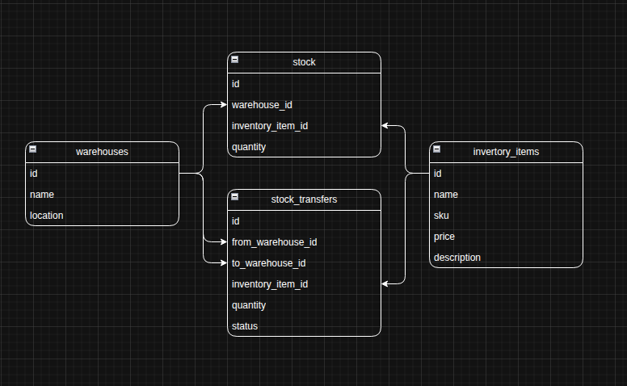

# Database Entity Relationship Diagram

Visual representation of the inventory management database schema and relationships.

---

## 📊 ERD Overview

The Entity Relationship Diagram (ERD) provides a visual blueprint of the database structure, showing all tables, relationships, and constraints in the inventory management system.

### Image Reference
- **File**: `img.png`
- **Format**: PNG
- **Tool**: Draw.io (`erd.drawio`)
- **Last Updated**: [Update when modified]

### Database ERD

---

## 🗄️ Schema Entities

### Core Tables

| Table | Primary Key | Key Features | Relationships |
|-------|-------------|--------------|---------------|
| **users** | `id` | Authentication, 2FA support | Laravel Fortify integration |
| **warehouses** | `id` | Unique name, location | 1:N → stocks, stock_transfers (from/to) |
| **inventory_items** | `id` | Unique SKU, price, description | 1:N → stocks, stock_transfers |
| **stocks** | `id` | Pivot table, quantity tracking | N:1 → warehouses, inventory_items |
| **stock_transfers** | `id` | Transfer tracking between warehouses | N:1 → warehouses (from/to), inventory_items |

### Support Tables

| Table | Primary Key | Purpose |
|-------|-------------|---------|
| **personal_access_tokens** | `id` | Laravel Sanctum API authentication |
| **cache** | `key` | Laravel cache storage |
| **jobs** | `id` | Laravel queue system |

---

## 🔗 Relationship Types

### One-to-Many (1:N)
- **Warehouse → Stocks**: A warehouse can store multiple inventory items
- **Warehouse → StockTransfers (from)**: A warehouse can send stock transfers to other warehouses
- **Warehouse → StockTransfers (to)**: A warehouse can receive stock transfers from other warehouses
- **InventoryItem → Stocks**: An inventory item can be stored in multiple warehouses
- **InventoryItem → StockTransfers**: An inventory item can be transferred between warehouses

### Many-to-Many (N:M)
- **Warehouses ↔ InventoryItems**: Implemented through `stocks` join table with pivot data (quantity)

---

## 🚀 Performance Considerations

### Indexed Columns
- Primary keys (all tables)
- `warehouses.name` — Warehouse lookups
- `inventory_items.sku` — Product lookups
- `stocks(warehouse_id, inventory_item_id)` — Stock queries
- Foreign keys — Join optimization

---

## 🛡️ Constraints & Business Rules

### Database Constraints
- `warehouses.name` — UNIQUE index for warehouse identification
- `inventory_items.sku` — UNIQUE index for inventory item identification
- `stocks(warehouse_id, inventory_item_id)` — COMPOSITE UNIQUE prevents duplicate stock records
- Foreign keys with CASCADE DELETE for data integrity

### Business Logic
- **Low Stock Detection**: Automatic event dispatch when stock quantity falls below 5 units
- **Stock Transfers**: Track movement of inventory items between warehouses
- **Quantity Tracking**: Real-time stock levels per warehouse-inventory combination

---

*This ERD reflects the current database schema as implemented in the migrations. For the most up-to-date structure, refer to the migration files in `database/migrations/`.*
