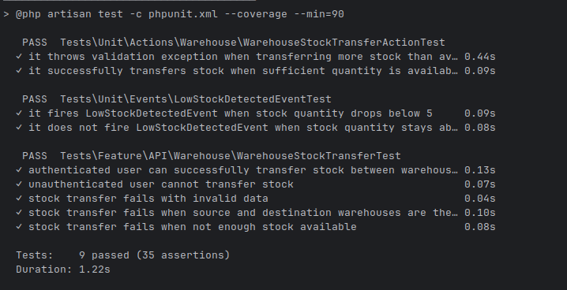

# Testing

Testing strategy, coverage, and development tools.

---

## 🧪 Test Types

| Type | Tool         | Location | Focus             |
|------|--------------|----------|-------------------|
| **Unit Tests** | Pest         | `tests/Unit/` | Actions, Events   |
| **Feature Tests** | Pest      | `tests/Feature/` | HTTP flows        |
| **Static Analysis** | PHPStan      | Config: `phpstan.neon` | Type safety       |
| **Code Style** | Laravel Pint | Config: `pint.json` | PSR-12 compliance |

---

## 📁 Test Structure

```
tests/
├── Feature/
│   └── API/
│       └── Warehouse/
│           └── WarehouseStockTransferTest.php
├── Unit/
│   ├── Actions/
│   │   └── Warehouse/
│   │       └── WarehouseStockTransferActionTest.php
│   └── Events/
│       └── LowStockDetectedEventTest.php
├── Pest.php          # Global test configuration
└── TestCase.php      # Base test case class
```

---


---

## 🚀 Running Tests

### Docker Mode

Tests run inside the PHP container:
```bash
make test
```

### Basic Commands

```bash
# Run all tests
make php-bash
# Then: php artisan test

# Run specific test file
php artisan test --filter WarehouseStockTransferTest

# Run with coverage
php artisan test --coverage

# Run specific test case
php artisan test --filter "authenticated user can successfully transfer stock"
```

---

## 📊 Test Coverage Areas

### API Endpoints
- **POST /api/warehouses-stock-transfers** - Stock transfer endpoint with full validation
- **Authentication** - Sanctum token-based authentication testing
- **Request Validation** - Input validation and error responses

### Business Logic
- **Stock Transfer Validation**: Source/destination warehouse validation
- **Quantity Management**: Insufficient stock detection and prevention
- **Data Integrity**: Database state verification after transfers

### Event System
- **Low Stock Detection**: Event firing when quantity drops below threshold
- **Event Suppression**: Proper event handling logic

### Actions
- **WarehouseStockTransferAction**: Business logic encapsulation testing
- **DTO Usage**: Data transfer object validation
- **Response Formatting**: JSON response structure validation

---

## 📝 Existing Tests

### Feature Tests

#### WarehouseStockTransferTest.php
- **`authenticated user can successfully transfer stock between warehouses`** - Tests successful stock transfer with authentication
- **`unauthenticated user cannot transfer stock`** - Tests authentication requirement
- **`stock transfer fails with invalid data`** - Tests validation errors for invalid input
- **`stock transfer fails when source and destination warehouses are the same`** - Tests business rule validation
- **`stock transfer fails when not enough stock available`** - Tests insufficient stock validation

### Unit Tests

#### WarehouseStockTransferActionTest.php
- **`it throws validation exception when transferring more stock than available`** - Tests action class validation
- **`it successfully transfers stock when sufficient quantity is available`** - Tests successful action execution

#### LowStockDetectedEventTest.php
- **`it fires LowStockDetectedEvent when stock quantity drops below 5`** - Tests event firing logic
- **`it does not fire LowStockDetectedEvent when stock quantity stays above 5`** - Tests event suppression logic

---

## 🔧 Test Configuration

### Global Setup (Pest.php)

```php
// Uses RefreshDatabase for clean state
pest()->extend(Tests\TestCase::class)
    ->use(Illuminate\Foundation\Testing\RefreshDatabase::class)
    ->in('Feature');

// Unit tests also get fresh database
pest()->extend(Tests\TestCase::class)
    ->use(Illuminate\Foundation\Testing\RefreshDatabase::class)
    ->in('Unit');
```

---

*This testing guide covers the current testing setup. For the most up-to-date test files, refer to the `tests/` directory.*
